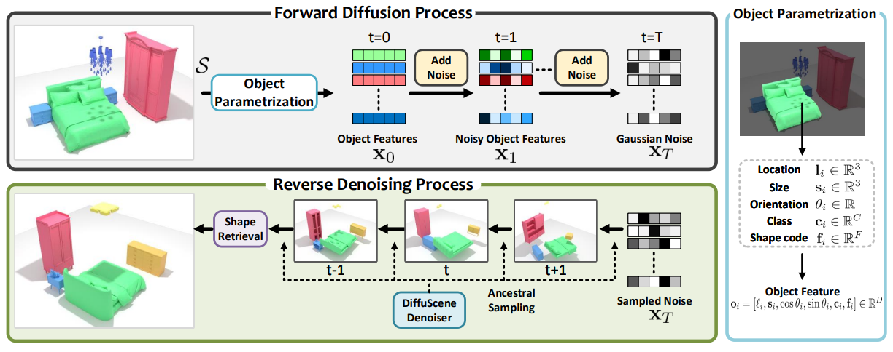
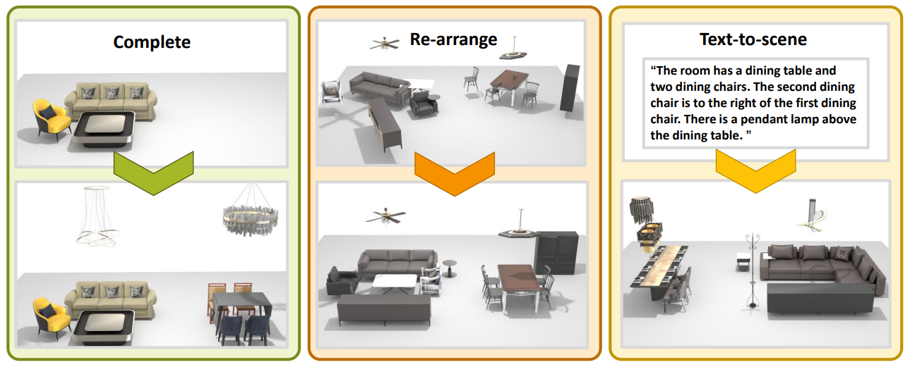

# DiffuScene

[**Paper**](https://arxiv.org/abs/2303.14207.pdf) | [**arXiv**](https://arxiv.org/abs/2303.14207.pdf)  | [**Video**](https://www.youtube.com/embed/VkBey2ZHA6E) | [**Project Page**](https://tangjiapeng.github.io/projects/DiffuScene/) <br>

This is the repository that contains source code for the paper:

**DiffuScene: Scene Graph Denoising Diffusion Probabilistic Model for Generative Indoor Scene Synthesis**

- We present DiffuScene, a diffusion model for diverse and realistic indoor scene synthesis.
<div style="text-align: center">

</div

- It can facilitate various down-stream applications: scene completion from partial scenes (left); scene arrangements of given objects (middle); scene generation from a text prompt describing partial scene configurations (right).
<div style="text-align: center">

</div>


If you find DiffuScene useful for your work please cite:

```
@inproceedings{
    tang2023diffuscene,
    title={DiffuScene: Scene Graph Denoising Diffusion Probabilistic Model for
      Generative Indoor Scene Synthesis},
    author={Tang, Jiapeng and Nie Yinyu and Markhasin Lev and Dai Angela and Thies Justus and Nie{\ss}ner, Matthias},
    booktitle={arxiv},
    year={2023},
    }
```

Contact [Jiapeng Tang](mailto:tangjiapengtjp@gmail.com) for questions, comments and reporting bugs.


## Installation & Dependencies
You can create a conda environment called ```diffuscene``` using
```
conda env create -f environment.yaml
conda activate diffuscene
```

Next compile the extension modules. You can do this via
```
python setup.py build_ext --inplace
pip install -e .
```

Install ChamferDistancePytorch
```
cd ChamferDistancePytorch/chamfer3D
python setup.py install
```

## Pretrained models
The pretrained models of DiffuScene Can be downloaded from [here](https://drive.google.com/drive/folders/1EhvyNCAWWto6vMt0vXWMKBoSdYR_9pC2?usp=drive_link).

## Dataset

The training and evaluation are based on the [3D-FRONT](https://tianchi.aliyun.com/specials/promotion/alibaba-3d-scene-dataset)
and the [3D-FUTURE](https://www.google.com/search?q=3d-future&oq=3d-fut&aqs=chrome.1.69i57j0j0i30l8.3909j0j7&sourceid=chrome&ie=UTF-8)
dataset. To download both datasets, please refer to the instructions provided in the dataset's
[webpage](https://tianchi.aliyun.com/specials/promotion/alibaba-3d-scene-dataset).

### Pickle the 3D-FUTURE dataset

To accelerate the preprocessing speed, we can sepcify the `PATH_TO_SCENES` environment variable for all scripts. This filepath contains the
parsed `ThreedFutureDataset` after being pickled. To pickle it, you can simply run this script as follows:
```
python pickle_threed_future_dataset.py path_to_output_dir path_to_3d_front_dataset_dir path_to_3d_future_dataset_dir path_to_3d_future_model_info --dataset_filtering room_type
``` 
Based on the pickled ThreedFutureDataset, we also provide a script to pickle the sampled point clouds of object CAD models, 
which are used to shape autoencoder training and latent shape code extraction.
```
python pickle_threed_future_pointcloud.py path_to_output_dir path_to_3d_front_dataset_dir path_to_3d_future_dataset_dir path_to_3d_future_model_info --dataset_filtering room_type
``` 
For example,
```
python pickle_threed_future_dataset.py  /cluster/balrog/jtang/3d_front_processed/ /cluster/balrog/jtang/3D-FRONT/ /cluster/balrog/jtang/3D-FUTURE-model /cluster/balrog/jtang/3D-FUTURE-model/model_info.json  --dataset_filtering threed_front_livingroom --annotation_file ../config/livingroom_threed_front_splits.csv

PATH_TO_SCENES="/cluster/balrog/jtang/3d_front_processed/threed_front.pkl" python pickle_threed_fucture_pointcloud.py /cluster/balrog/jtang/3d_front_processed/ /cluster/balrog/jtang/3D-FRONT/ /cluster/balrog/jtang/3D-FUTURE-model /cluster/balrog/jtang/3D-FUTURE-model/model_info.json  --dataset_filtering threed_front_livingroom --annotation_file ../config/livingroom_threed_front_splits.csv
```

Note that these two scripts should be separately executed for different room
types containing different objects. For the case of 3D-FRONT this is for the
bedrooms and the living/dining rooms, thus you have to run this script twice
with different `--dataset_filtering` and `--annotation_file`options. Please check the help menu for
additional details.

### Train shape autoencoder
Then you can train the shape autoencoder using all models from bedrooms/diningrooms/livingrooms.
```
cd ./scripts
PATH_TO_SCENES="/cluster/balrog/jtang/3d_front_processed/threed_front.pkl" python train_objautoencoder.py ../config/obj_autoencoder/bed_living_diningrooms_lat32.yaml your_objae_output_directory --experiment_tag  "bed_living_diningrooms_lat32" --with_wandb_logger
```

### Pickle Latent Shape Code
Next, you can use the pre-train checkpoint of shape autoencoder to extract latent shape codes for each room type. Take the bedrooms for example:
```
PATH_TO_SCENES="/cluster/balrog/jtang/3d_front_processed/threed_front.pkl" python generate_objautoencoder.py ../config/objautoencoder/bedrooms.yaml your_objae_output_directory --experiment_tag "bed_living_diningrooms_lat32"
```

### Preprocess 3D-Front dataset with latent shape codes
Finally, you can run `preprocessing_data.py` to read and pickle object properties (class label, location, orientation, size, and latent shape features) of each scene.
```
PATH_TO_SCENES="/cluster/balrog/jtang/3d_front_processed/threed_front.pkl" python preprocess_data.py /cluster/balrog/jtang/3d_front_processed/livingrooms_objfeats_32_64 /cluster/balrog/jtang/3D-FRONT/ /cluster/balrog/jtang/3D-FUTURE-model /cluster/balrog/jtang/3D-FUTURE-model/model_info.json --dataset_filtering threed_front_livingroom --annotation_file ../config/livingroom_threed_front_splits.csv --add_objfeats
```
The proprossed datasets can also be downloaded from [here](https://drive.google.com/file/d/1UNSFN0kULyOzUErDPVvkKYbmfzA-4MsG/view?usp=sharing).


## Training & Evaluate Diffuscene
To train diffuscene on 3D Front-bedrooms, you can run 
```
./run/train.sh
./run/train_text.sh
```

To generate the scene of unconditional and text-conditioned scene generation with our pretraiened models, you can run 
```
./run/generate.sh
./run/generate_text.sh
```
If you want to calculate evaluation metrics of bbox IoU and average number of symmetric pairs, you can add the option```--compute_intersec```.
Please note that our current text-conditioned model is used to generate a full scene configuration from a text prompt of partial scene (2-3 sentences).
If you want to evaluate our method with text prompts of more sentences, you might need to re-train our method.

## Evaluation Metrics
To evaluate FID and KID from rendered 2D images of generated and reference scenes, you can run:
```
python compute_fid_scores.py $ground_truth_bedrooms_top2down_render_folder $generate_bedrooms_top2down_render_folder  ../config/bedroom_threed_front_splits.csv
python compute_fid_scores.py $ground_truth_diningrooms_top2down_render_folder $generate_diningrooms_top2down_render_folder  ../config/diningroom_threed_front_splits.csv
```

To evaluate improved precision and recall, you can run:
```
python improved_precision_recall.py $ground_truth_bedrooms_top2down_render_folder $generate_bedrooms_top2down_render_folder  ../config/bedroom_threed_front_splits.csv
python improved_precision_recall.py $ground_truth_diningrooms_top2down_render_folder $generate_diningrooms_top2down_render_folder  ../config/diningroom_threed_front_splits.csv
```

## Relevant Research

Please also check out the following papers that explore similar ideas:
- Fast and Flexible Indoor Scene Synthesis via Deep Convolutional Generative Models [pdf](https://arxiv.org/pdf/1811.12463.pdf)
- Sceneformer: Indoor Scene Generation with Transformers [pdf](https://arxiv.org/pdf/2012.09793.pdf)
- ATISS: Autoregressive Transformers for Indoor Scene Synthesis [pdf](https://arxiv.org/pdf/2110.03675.pdf)
- Indoor Scene Generation from a Collection of Semantic-Segmented Depth Images [pdf](https://arxiv.org/abs/2108.09022)
- Scene Synthesis via Uncertainty-Driven Attribute Synchronization [pdf](https://arxiv.org/abs/2108.13499)
- LEGO-Net: Learning Regular Rearrangements of Objects in Rooms[pdf](https://arxiv.org/abs/2301.09629)

## Acknowledgements

Most of the code is borrowed from [ATISS](https://github.com/nv-tlabs/ATISS). We thank for Despoina Paschalidou her great works and repos.


